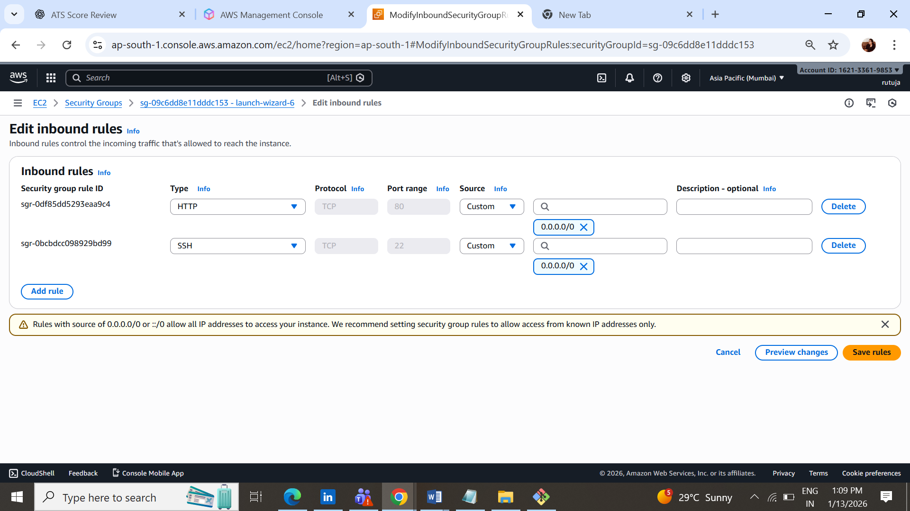
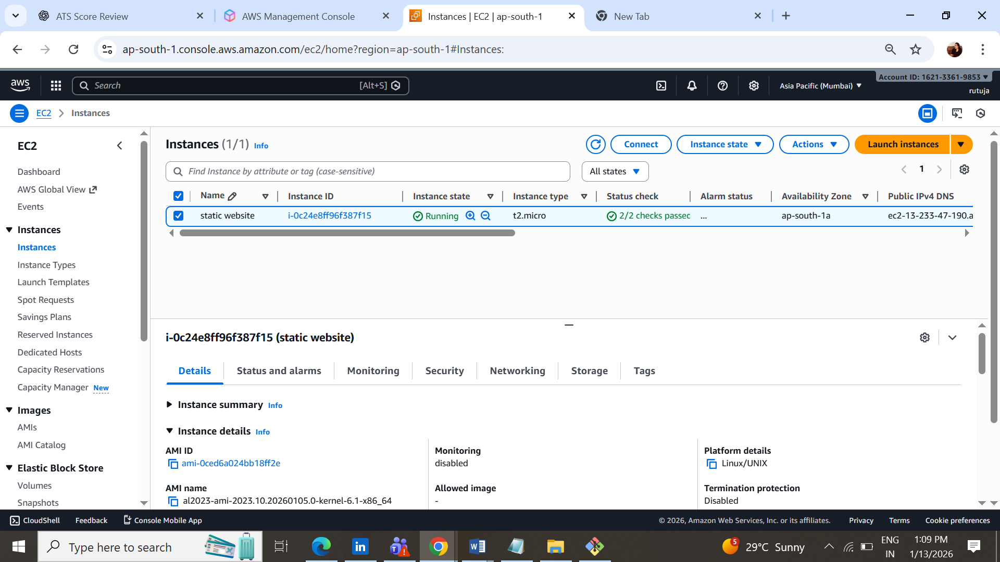
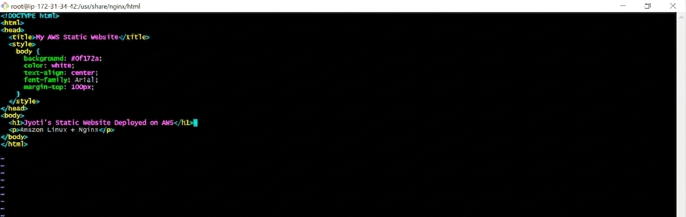
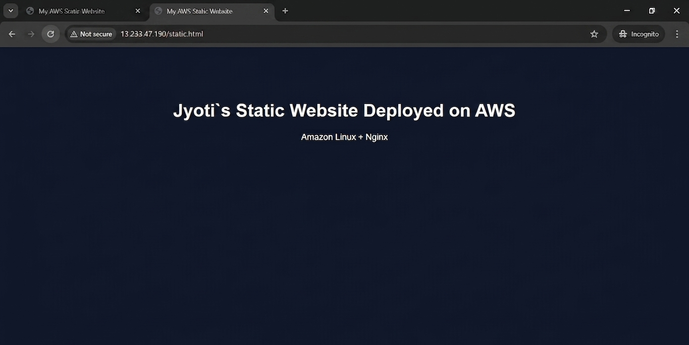

#  Deploy Static Web Application on AWS using Amazon Linux & Nginx

This guide explains how to deploy a **static website** on an **AWS EC2
instance (Amazon Linux 2)** using **Nginx** as a web server.

------------------------------------------------------------------------

## 🏗 Architecture

User → Internet → EC2 (Amazon Linux) → Nginx → Static Website Files

------------------------------------------------------------------------

## Prerequisites

-   AWS Account
-   EC2 Key Pair (.pem file)
-   Basic Linux knowledge

------------------------------------------------------------------------

## STEP 1: Launch EC2 Instance

1.  Go to **AWS Console → EC2 → Launch Instance**
2.  Select **Amazon Linux 2 AMI**
3.  Choose Instance Type: `t2.micro`
4.  Create/Select Key Pair and download `.pem`
5.  Network Settings:
    -   Auto-assign Public IP: **Enable**
6.  Security Group Rules:
    -   SSH (22) → My IP
    -   HTTP (80) → 0.0.0.0/0
    -   HTTPS (443) → 0.0.0.0/0
    
7.  Click **Launch Instance**



------------------------------------------------------------------------

## STEP 2: Connect to EC2

### Linux

``` bash
chmod 400 mykey.pem
ssh -i mykey.pem ec2-user@<PUBLIC-IP>
```

### Windows PowerShell

``` powershell
ssh -i mykey.pem ec2-user@<PUBLIC-IP>
```

------------------------------------------------------------------------

##  STEP 3: Update Packages

``` bash
sudo yum update -y
```

------------------------------------------------------------------------

##  STEP 4: Install Nginx

``` bash
sudo amazon-linux-extras enable nginx1
sudo yum install nginx -y
nginx -v
```

------------------------------------------------------------------------

## STEP 5: Start & Enable Nginx

``` bash
sudo systemctl start nginx
sudo systemctl enable nginx
sudo systemctl status nginx
```

------------------------------------------------------------------------

## STEP 6: Test Nginx

Open browser:

    http://<PUBLIC-IP>

You should see **Welcome to nginx!**

------------------------------------------------------------------------

## STEP 7: Deploy Website Files

``` bash
cd /usr/share/nginx/html
sudo mv index.html index.html.bak
sudo nano index.html

```

### Sample HTML

``` html
<!DOCTYPE html>
<html>
<head>
  <title>AWS Static Website</title>
  <style>
    body { background:#0f172a; color:white; text-align:center; margin-top:100px; }
  </style>
</head>
<body>
  <h1> jyoti`s Website Deployed on AWS EC2</h1>
  <p>Amazon Linux + Nginx</p>
</body>
</html>
```

Save and exit.

------------------------------------------------------------------------

## STEP 8: Fix Permissions

``` bash
sudo chown -R nginx:nginx /usr/share/nginx/html
sudo chmod -R 755 /usr/share/nginx/html
sudo systemctl restart nginx
```

------------------------------------------------------------------------

## STEP 9: Verify Website

Open browser:

    http://<PUBLIC-IP>

Your website is now LIVE 


------------------------------------------------------------------------

##  Important Nginx Paths

  Purpose     Path
  ----------- --------------------------
  Web Root    /usr/share/nginx/html
  Config      /etc/nginx/nginx.conf
  Logs        /var/log/nginx/
  Error Log   /var/log/nginx/error.log

------------------------------------------------------------------------

## Optional: Enable HTTPS (SSL)

``` bash
sudo yum install certbot python2-certbot-nginx -y
sudo certbot --nginx
```

------------------------------------------------------------------------

##  Best Practices

-   Use Elastic IP
-   Restrict SSH to your IP
-   Enable CloudWatch Monitoring
-   Use ALB for production

------------------------------------------------------------------------

## Resume Project Description

**Static Web Application Deployment on AWS**\
- Deployed static website using EC2 and Nginx\
- Configured Linux permissions and security groups\
- Implemented production-ready server setup

------------------------------------------------------------------------

## Author

Jyotirmoyee Rout\
DevOps \| AWS \| Linux
